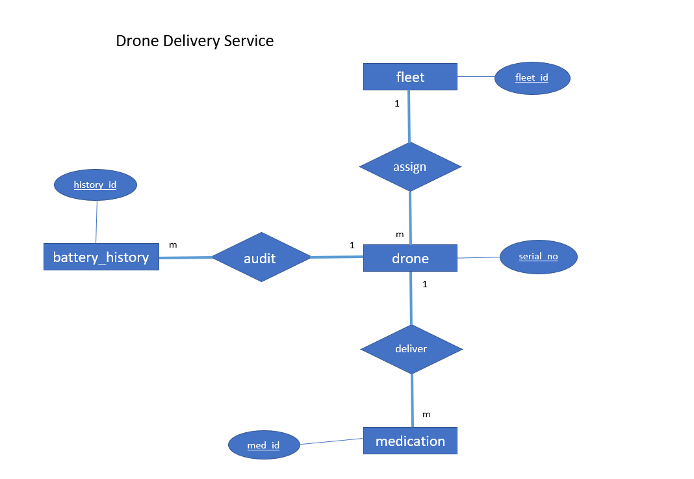

# drone_delivery_service
_Medications delivery service via drones_

## Technologies
- Apache Maven 3.8.6
- Spring Boot 2.7.3
- Java 11
- Postgres 14

## Solution


## Features
- Add a fleet
- Get all fleets
- Register a drone into a fleet
- Get all drones which are available to load medications
- Load medication items into a drone
- Get all loaded medication items for a given drone
- Get battery capacity of a drone
- Update state of the drone after finish with loading (LOADED->DELIVERING->DELIVERED->RETURNING->IDLE)

## Schedulers
- Logging battery capacity history of all the drones in each 10 minutes
- Updating drones battery level percentage in each 5 minutes by reducing with 1% (For testing purposes of battery audit, if not necessary please comment _batteryPercentageUpdate_ method's scheduled annotation in [_DroneConfig.java_](src/main/java/com/delivery/drone/config/DroneConfig.java))

## Assumptions
- Even in the LOADING state user can change drone state into LOADED and proceed with the delivery. (Once IDLE drones start to loading then system will automatically update drone's state into LOADING)
- At least one medication item should be loaded in order to proceed with LOADED and next states of the cycle (Otherwise system will automatically update LOADING state to LOADED once max weight limit met)

## Configuration

> Create a database in Postgres and please configure [_application.properties_](src/main/resources/application.properties) with your `Host, DB name, Username, Password` details.

## Build the project

Please run below command in project root:

```sh
mvn clean install
```

## Run the project

Please run below commands in project root:

```sh
cd target
java -jar drone-0.0.1-SNAPSHOT.jar
```

## Postman Collection

> You can import [_postman collection_](postman_collection/drone-delivery-service.postman_collection.json) into your postman workspace and see all the REST APIs with json requests which are included with success, unsuccess and validations checking sample responses.

## Screenshots

> You can find [_GitHub commit history here_](img/Screenshots/GitHub commit history)

> You can find [_Postman changelog here_](img/Screenshots/Postman changelog)


----------