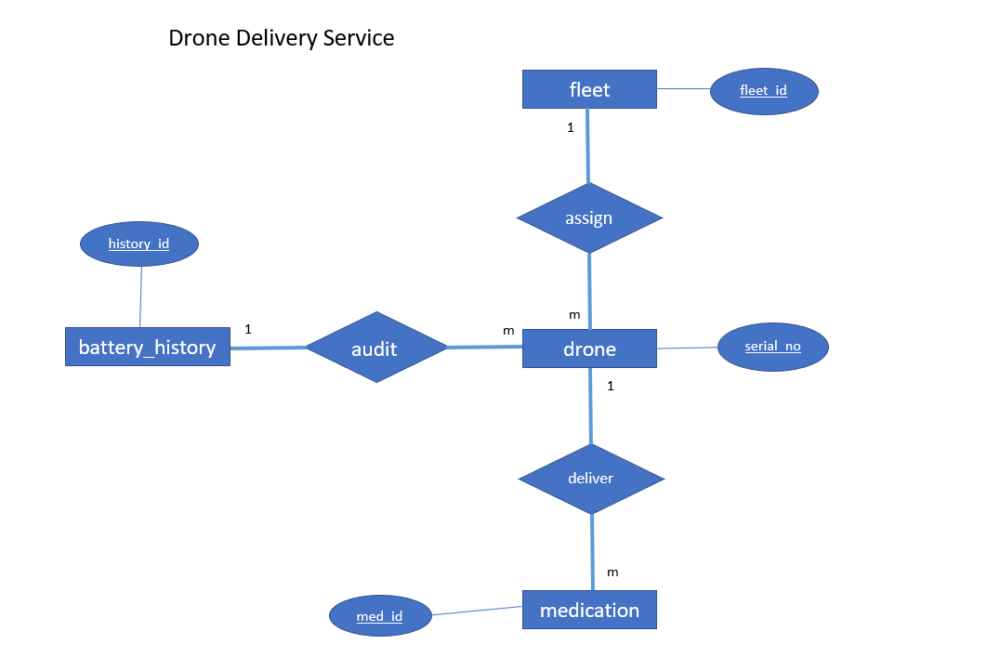

# drone_delivery_service
_Medications delivery service via drones_

## Technologies
- Apache Maven 3.8.6
- Spring Boot 2.7.3
- Java 11
- Postgres 14

## Solution

## Rest endpoints
- Add a fleet
- Get all fleets
- Register a drone to fleet
- Get all drones which have available weight to load medications
- Load medications into a drone (Drone state Loading and loaded once reach max weight)
- Get all loaded medication items for a given drone
- Get battery capacity of a drone
- Update state of the drone after finish loading (LOADED->DELIVERING->DELIVERED->RETURNING->IDLE)

## Schedulers
- Logging battery capacity history of all the drones in each 10 minutes
- Updating drones battery level percentage in each 5 minutes by reducing with 1% (For testing purposes of battery audit, if not necessary please comment _batteryPercentageUpdate_ method's scheduled annotation in [_DroneConfig.java_](src/main/java/com/delivery/drone/config/DroneConfig.java))

